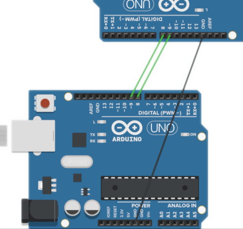

### Communiquer entre 2 arduinos  

Durée : 4h00


### Introduction

Séquence


### Contexte

L'objectif est de connecter 2 arduinos entre eux pour que le 1er envoie des informations au 2nd


### Après cette séquence

Vous saurez transferer des informations d'un arduino à un autre arduino par une liaison de type série (filaire ou par bluetooth)


### Prérequis

- Savoir utiliser Tinkercad
- Avoir déjà utilisé l'IDE Arduino
- Connaitre les bases de la programmation arduino
- Maitriser le traitement des chaines de caractères (caractère de fin de ligne)


### Mode opératoire 1

- Brancher les 2 arduinos ensembles grâce à 2 câbles sur des GPIO (pins)
- Relier les 2 arduinos ensemble sur la terre (pin GND)


### Mode opératoire 2

Les pin à connecter sur les arduinos sont les pins DIGITAL (PWM). Leur numéro n'est pas important mais pour des raisons de lisibilité il est préférable d'utiliser les mêmes numéros, soit pin 8 et pin 9.


### Image 1 


### Image 2


#### 2 arduinos, 2 programmes - 1 

Chaque arduino aura une tâche spécifique. Le 1er envoie l'information, le 2nd la réceptionne.


#### 2 arduinos, 2 programmes - 2

Dans chacun des programmes, un paramétrage est nécessaire : 
- inclure une bibliothèque de fonctions déjà développée
- préciser la vitesse de transmission entre les 2 arduinos


# les principes de codage


### les principes de codage

- [X] la bibliothèque SoftwareSerial.h
- [X] void setup()
- [X] void loop()
- [X] envoyer et recevoir un message


### <SoftWareSerial.h> - 1

    #include <SoftwareSerial.h>
    SoftwareSerial liaisonSerie2(9,8);

La bibliothèque 'SoftwareSerial.h' offre des fonctions et méthodes facilitant la transmission des informations sur la liaison série.

Il faut la déclarer au début du programme (#include) et l'utiliser en créant une variable (ici liaisonSerie2).


### <SoftWareSerial.h> - 2

```java 
#include <SoftwareSerial.h>
SoftwareSerial liaisonSerie2(9,8);
```

2 paramètres doivent doivent être communiqués : 
- Le paramètre 8 détermine le pin qui va envoyer des données sur la liaison
- Le paramètre 9 détermine le pin qui va réceptionner des données sur la liason


### <SoftWareSerial.h> - 3

Dans notre exemple, un fil suffirait puisque la transmission ne se fait que dans un sens.


### void setup() - 1

    void setup()
    {
        Serial.begin(9600);
        liaisonSerie2.begin(9600);
    }


### void setup() - 2

La méthode void setup() 

    void setup()
    {
        ...
    }

est exécutée lors de l'allumage de l'arduino. Elle contient tout le paramétrage du système. Void signifie que la fonction ne retourne aucun valeur. 


### void setup() - 3

    Serial.begin(9600)

définie la vitesse (9600 bits/s) qui sera utilisée pour l'affichage dans le moniteur

    liaisonSerie2.begin(9600)

définie la vitesse de transfert de données sur la liaison série. Il est impératif que sur l'autre élément (le 2nd arduino), la vitesse déclarée soit la même.


### void loop()

La structure void loop() 

    void loop()
    {
        ...
    }

est une boucle infinie. Le code lui appartenant s'exécute tant que l'arduino est alimenté.
C'est dans cette structure que sera écrit l'ensemble du code qui fera fonctionner l'arduino et gérera tous les évènements.


### Envoyer un message

Pour envoyer un message texte il faut utiliser la méthode print()
```Arduino
SoftwareSerial liaisonSerie2.print("bonjour");
```


### recevoir un message

Pour recevoir un message envoyé, il faut utiliser la méthode read()
```Arduino
String message = liaisonSerie2.read();
```


# TINKERCAD


### Construire




### Code Arduino 1

```Arduino
#include <SoftwareSerial.h>
SoftwareSerial liaisonSerie2(9,8);

String readString;
int ligne=1;

void setup()
{
    Serial.begin(9600);
    liaisonSerie2.begin(9600);
}
void loop()
{
    
    for (int i=0;i<50;i++)
    {	
        liaisonSerie2.print("message ");
        liaisonSerie2.println(ligne);
        ligne++;
    }
}	
    
```


### Code Arduino 2

```Arduino
#include <SoftwareSerial.h>
SoftwareSerial liaisonSerie2(9,8);
String readString;
char c=0;

void setup()
{
  Serial.begin(9600);
  liaisonSerie2.begin(9600);
}

void loop()
{
 delay(20);
 while (liaisonSerie2.available())
 { 
     while(c!='\n')
     {
       delay(10);
       c = liaisonSerie2.read();
       readString += c;   
	 }
     Serial.print (readString);
   	 readString="";
   	 c=' ';
 }       
}
```

