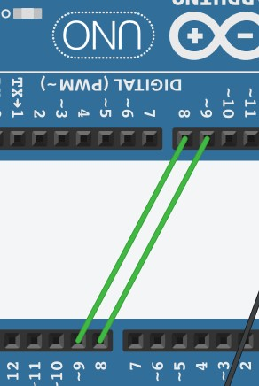
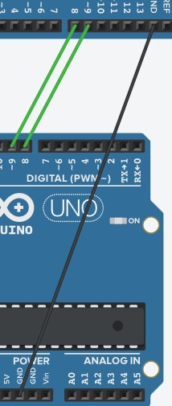
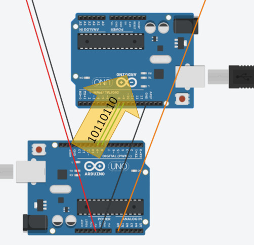

# Communiquer entre 2 arduinos  

### Introduction

Séquence

### Contexte

L'objectif est de connecter 2 arduinos entre eux pour que le 1er envoie des informations au 2nd

### Après cette séquence

Vous saurez transferer des informations d'un arduino à un autre arduino par une liaison de type série (filaire ou par bluetooth)

### Prérequis

- Savoir utiliser Tinkercad
- Avoir déjà utilisé l'IDE Arduino
- Connaitre les bases de la programmation arduino

### Mode opératoire 1

- Brancher les 2 arduinos ensembles grâce à 2 câbles sur des GPIO (pins)
- Relier les 2 arduinos ensemble sur la terre (pin GND)

### Mode opératoire 2

Les pin à connecter sur les arduinos sont les pins DIGITAL (PWM). Leur numéro n'est pas important mais pour des raisons de lisibilité il est préférable d'utiliser les mêmes numéros, soit pin 8 et pin 9.

### Image 1 

### Image 2

### 2 arduinos, 2 programmes

Chaque arduino aura une tâche déterminer. Le 1er envoie l'information, le 2nd la réceptionne.

Dans chacun des programmes, un paramétrage est nécessaire : 
- inclure la bibliothèque déjà développée
- préciser la vitesse de transmission entre les 2 arduinos

### <SoftWareSerial.h> - 1

    #include <SoftwareSerial.h>
    SoftwareSerial liaisonSerie2(9,8);

La bibliothèque 'SoftwareSerial.h' offre des fonctions et méthodes facilitant la transmission des informations sur la liaison série.

Il faut la déclarer au début du programme (#include) et l'utiliser en créant une variable.

### <SoftWareSerial.h> - 2

    #include <SoftwareSerial.h>
    SoftwareSerial liaisonSerie2(9,8);

Le paramètre 8 détermine le pin allant envoyer des données sur la liaison
Le paramètre 9 détermine le pin allant réceptionner des données sur la liason

### <SoftWareSerial.h> - 3

Dans notre exemple, un fil suffirait puisque la transmission ne se fait que dans un sens.

### setup() - 1

    void setup()
    {
        Serial.begin(9600);
        liaisonSerie2.begin(9600);
    }

